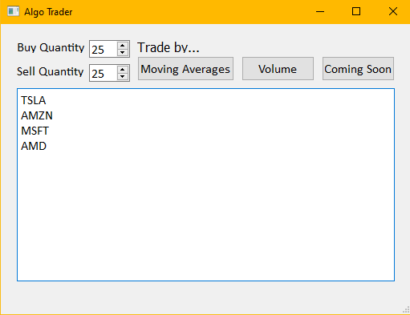

# Algorithmic Trading Bot

Developed in Python 3  
Technologies: InteractiveBrokers TWS API, ib_insync, PyQT5

## About this Algorithmic Trading Application:
This application simplifies the process of searching through stocks to find the best ones to trade based on specific technical indicators. We developed through methods of trading:  

1. Moving Averages
2. On-Balance Volume
3. Growth (Coming soon)

The program will search through the stocks you specify in the text box and trade ones based on the technical indictor you choose.  

## Trading Methods:
### <u>Moving Averages</u>
The application calculates the 50 and 200 day moving averages of each stock and compares them with the current trading price.  
<b>Buying</b> - if the stock is trading higher than the 50 and 200 day averages, it buys more of the stock.  
<b>Selling</b> - if the stock is trading lower than the 50 and 200 day averages, it sells some of the stock.

### <u>On-Balance Volume</u>
The application uses trading volume and closing prices in the past 120 days to track "On-Balance Volume", or OBV, which is observed for trends along with closing prices.  

The following are scenarios where action will be taken:
- OBV hits a new high while the price tests resistance: <b>bullish divergence</b>, predicting the price will break resistance and surge higher, playing catch-up.
- The price hits a new high while OBV grinds at or below the last resistance level: <b>bearish divergence</b>, predicting the rally will stall or reverse.
- OBV hits new low while price tests support: <b>bearish divergence</b>, predicting the price will break support and surge lower, playing catch up.
- The price hits a new low while OBV grinds at or above the last support level: <b>bullish divergence</b>, predicting the sell-off will stall or reverse.
- OBV matches the price action, higher or lower: <b>bullish or bearish convergence</b>, depending on direction.

In <b>bullish</b> scenarios, the application will buy, and in <b>bearish</b> scenarios, the application will sell.

## How to use:
*Important - Make sure your TWS application has API connections enabled (https://interactivebrokers.github.io/tws-api/initial_setup.html)

1. Open and log into IB TWS desktop application (live or paper trading).
2. Download the code and run the "app.py" file,
3. When the GUI appears, enter your desired buy and sell quantities.
4. Click the method of trade you want to use and pow!
